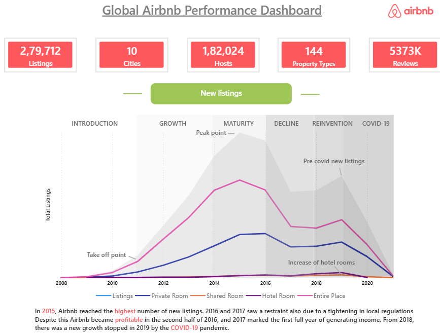
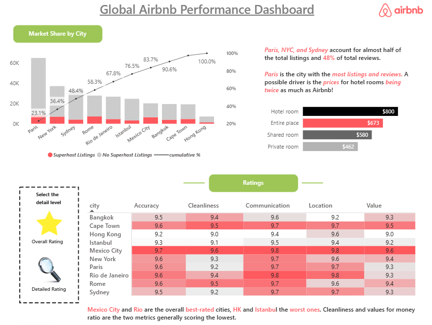
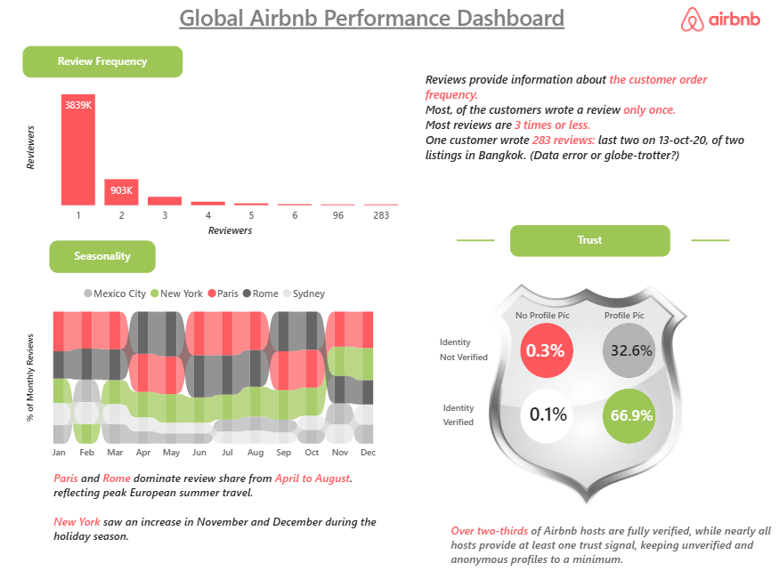

# 🏡 Global Airbnb Performance Dashboard | Power BI

## ⚠️ Note
The original Power BI (.pbix) file is not included in this repository because it exceeds GitHub's file size limit (100 MB). Dashboard screenshots are provided to showcase the report design, interactive visuals, and business insights.

## 📌 Project Overview

This Power BI dashboard analyzes Airbnb listings across major global cities to uncover insights into listing performance, customer reviews, host verification, pricing, and market trends. The dashboard provides interactive visualizations that help understand business performance and customer behavior.

---

## 🛠️ Tools & Technologies

- Power BI
- Power Query
- DAX (Data Analysis Expressions)
- Microsoft Excel

---

## 📊 Dashboard Features

### 📈 Overview
- Total Listings
- Total Reviews
- Total Cities
- Total Hosts
- Property Type Distribution
- Listing Growth Trend
- Business Lifecycle Analysis
- Interactive Filters

### ⭐ Ratings Analysis
- Average Ratings by City
- Market Share Analysis
- Host Verification Analysis
- Property Type Price Comparison
- Rating Heatmap

### 📝 Reviews Analysis
- Monthly Review Trend
- Review Distribution
- Top 5 Cities by Reviews
- Seasonality Analysis
- Host Trust Analysis

---

## 📌 Key Insights

- Paris records the highest number of Airbnb listings and customer reviews.
- Entire Home/Apartments generate the largest share of listings.
- Nearly 67% of hosts have completed identity verification.
- Customer reviews increase during peak travel seasons.
- Most listings receive only a small number of reviews, while a few highly popular listings account for a significant share of total reviews.

---

## 💡 Skills Demonstrated

- Data Cleaning & Transformation
- Data Modeling
- DAX Measures
- KPI Design
- Interactive Dashboard Development
- Business Intelligence
- Data Visualization
- Report Design & Storytelling

---

# 🖼️ Dashboard Preview

## Overview

## Ratings Analysis

## Reviews Analysis

## 📂 Repository Contents

- README.md
- Dashboard Screenshots

## 📬 Connect With Me

**LinkedIn: www.linkedin.com/in/tanvi-hulavale-6859b9322

**GitHub: tanvihulavale6-GH

⭐ If you found this project interesting, feel free to star the repository and share your feedback!
